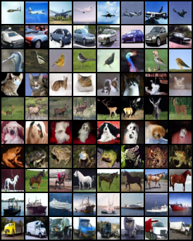

# Unofficial Implementation of [Classifier-free Diffusion Guidance](https://arxiv.org/abs/2207.12598)
The Pytorch implementation is adapted from [openai/guided-diffusion](https://github.com/openai/guided-diffusion) with modifications for classifier-free conditioned generation. The dataset used for training is cifar-10. The platform I use is Ubuntu 20.04.

During the training porcess, I adapt the file *Scheduler.py* from [zoubohao/DenoisingDiffusionProbabilityModel-ddpm-](https://github.com/zoubohao/DenoisingDiffusionProbabilityModel-ddpm-), which is different from my implementation mainly on one technical detail : **How to represent the embeddings of null token of class identifier**. According to another academic paper [Video Diffusion Models](https://arxiv.org/abs/2204.03458) by the same authors, I use the same method as theirs in this detail.
## How to run
First, you need to do some preparations:
```bash
mkdir sample
mkdir model
ln -s absolute/path/to/cifar-10 ./cifar-10-batches-py
```
### How to train
```bash
make train
```
**NOTICE** : hyperparameter settings are in the file *train.py*
### How to sample
To get pictures, you need to excute the following command:
```bash
make samplepict
```
To get .npz files(used for FID calculation), you need to excute the following command:
```bash
make samplenpz
```
**NOTICE** : hyperparameter settings are in the file *sample.py*
## Performance

